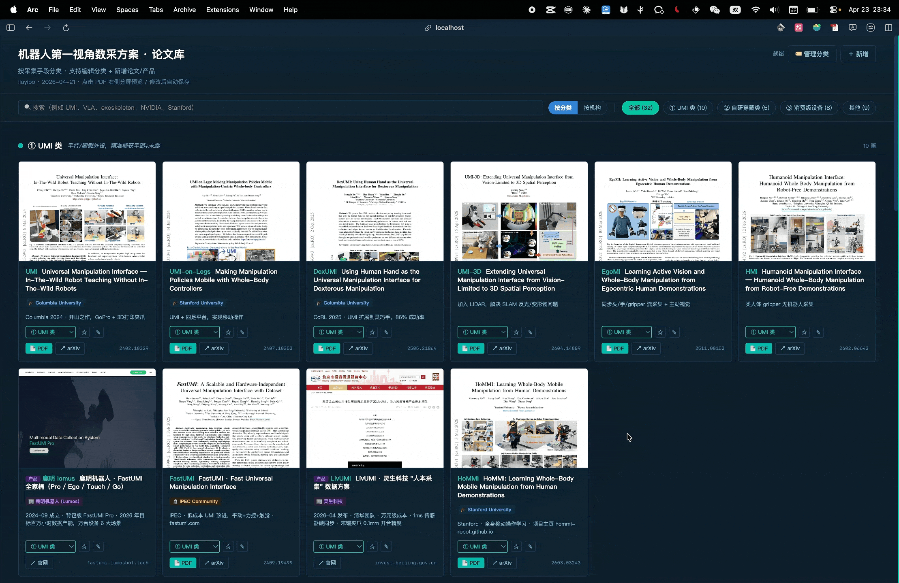
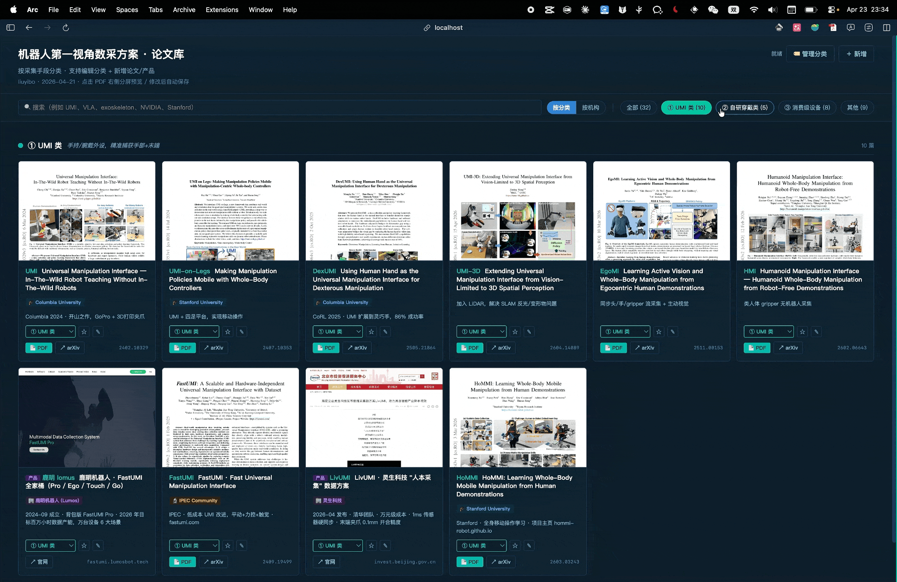
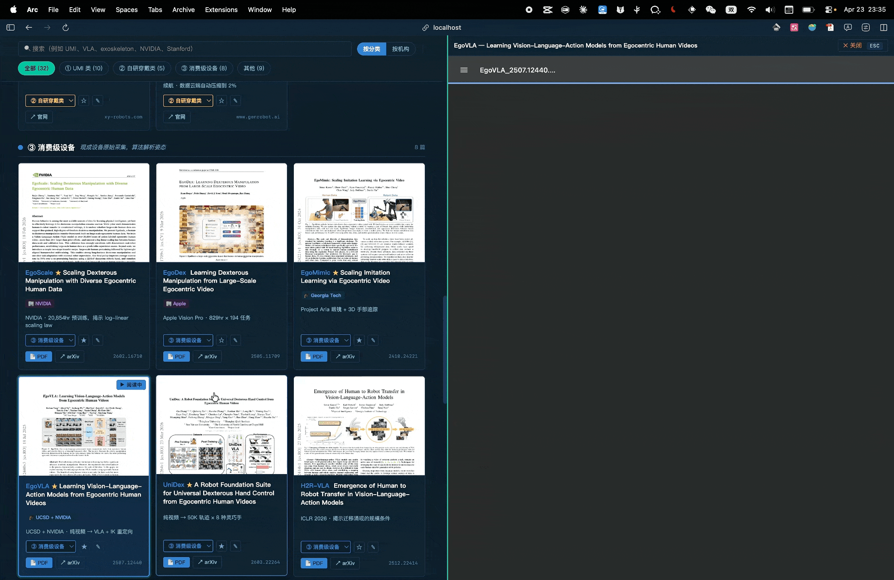

# Paper Library Kit

我们大量跟进某个领域的论文时，下载的论文堆在一起很容易眼花缭乱。**Paper Library Kit** 则提供一种「电影墙」式的管理方式：

- 每篇论文有封面缩略图 + 标签分类，一眼联想内容
- 本地 PDF 分屏阅读，不用在多个页面跳来跳去
- 输入 arXiv 链接，自动下载 PDF、生成缩略图、填写基本信息

| 论文墙 | 分类筛选 | 分屏查看 |
|:---:|:---:|:---:|
|  |  |  |

---

## 非 AI 用户使用

不使用 AI 也可以独立运行和维护论文库。

### 快速启动

```bash
git clone https://github.com/doubleLLL3/paper-library-kit ~/paper-library
cd ~/paper-library
pip install -r requirements.txt
bash start.sh
# 浏览器打开 http://localhost:8765
```

### 添加论文 / 产品

点击页面右上角「＋ 新增」按钮，弹出三种导入方式：

- **📁 本地 PDF**：拖拽或点击上传本地 PDF，自动提取标题、arXiv ID、机构信息并回填，缩略图自动生成
- **📖 arXiv**：输入 arXiv ID（如 `2402.10329`）或完整链接，自动下载 PDF、获取元数据、生成缩略图
- **🏢 公司产品**：输入产品/公司 URL，自动抓取 og:image 作为封面、填充标题和机构名

### 管理论文

- **收藏**：卡片右上角悬浮 ★，点击收藏/取消；顶部筛选栏可按「★ 收藏」过滤
- **批量修改分类**：勾选多张卡片（左上角 checkbox），右下角浮出操作栏选择目标分类并应用
- **编辑**：点卡片上的 ✎ 按钮，修改标题、机构、备注等字段
- **分屏阅读**：点论文卡片的缩略图或「📄 PDF」按钮

### 管理分类

点击「🏷️ 管理分类」可新增 / 编辑 / 删除分类：

- 新增时只需填写**类名**和颜色，ID 自动生成
- 卡片底部分类下拉末尾有「＋ 添加分类」快捷入口

### 筛选与搜索

- 顶部搜索框支持标题、简称、机构、刊会、CCF、备注全文搜索
- 筛选栏支持：全部 / ★ 收藏 / 按主题分类 / 图模块 / 按发表类型 / 按 CCF / 按收录形式 / 按具体刊会 / 按机构类型（🎓 学校 / 🏢 公司）
- 右上角可切换「按主题」「图模块」「按发表类型」「按 CCF」「按形式」「按刊会」或「按机构」分组视图
- 论文编辑和新增表单支持填写发表刊会/期刊、发表类型、CCF A/B/C、收录形式或未收录/不适用
- Findings、Workshop、Demo、ARR submission、arXiv/预印本等会单独显示收录形式；其中能对应到父刊会的条目会按父刊会进入 CCF A/B/C
- 「图模块」会通过 OpenAlex 拉取每篇论文的 `referenced_works`，只绘制本地库内论文之间的引用关系；结果缓存到 `.cache/citation_graph.json`，可点击「更新引用图」重新生成
- 每张论文封面右上角的 `◎` 按钮可打开单篇论文知识图谱：以该论文为中心，放射状展示它引用的全部参考文献，并标出哪些节点已匹配到本地库
- 每张论文封面内置 0.5-5 星评分条；默认不评分，点击星星左半边为半星、右半边为整星，再点同一评分可清空
- 每张论文封面右侧的 `✎` 按钮可打开本篇论文的长文档笔记，支持 Markdown / 纯文本输入并自动保存到 `readingNote`

### 停止服务

```bash
bash stop.sh
```

---

## AI 用户使用

打开你的 AI 助手（Claude Code、Cursor 等支持工具调用的 AI Agent），对他说：

> 基于这个开源库帮我初始化一个论文库：https://github.com/doubleLLL3/paper-library-kit

AI 会接管后续所有步骤，只在必要时向你提问。

日常使用，可以直接说：

> 帮我添加这篇论文：http://xxx（论文地址）
> 帮我深度阅读这篇论文：http://xxx / xxx（论文名称）
> ...

🎉 更多使用方式等待您开发！

---

<!--
==========================================================
  !! AI AGENT — 从这里开始，不要直接执行 clone !!
  当用户说「帮我初始化论文库」时，必须先完成以下交互
  再动手做任何操作。
==========================================================
-->

## AI 初始化流程（AI Agent 专用）

> **AI 注意：读到这里必须先问用户两个问题，再执行任何 bash 命令。**

用户不需要懂编程，你来负责所有操作，只在必要时问用户几个问题。

### 第 1 步：确认安装位置

询问用户：
> "你想把论文库安装在哪里？没有特别想法直接说「好」，默认安装到 `~/paper-library`"

```bash
git clone https://github.com/doubleLLL3/paper-library-kit ~/paper-library
cd ~/paper-library
```

### 第 2 步：检查依赖

```bash
python3 --version   # 必须，无需安装其他包

# poppler（生成封面缩略图）
command -v pdftoppm || brew install poppler        # macOS
command -v pdftoppm || sudo apt-get install -y poppler-utils   # Linux
```

### 第 3 步：问用户 2 个问题

依次提问，等用户回答再问下一个：

**问题 1 — 库的名字**
> "你想给这个论文库起什么名字？不想改直接说「好」，默认叫 Paper Library"

**问题 2 — 现有 PDF 文件夹**
> "你有没有一个已经装了 PDF 的文件夹？有的话告诉我路径（比如 ~/Downloads/papers），没有直接说「没有」"

### 第 4 步：写入配置

更新 `papers.json` 里的 `meta` 字段：
```json
{
  "meta": {
    "title": "用户给的名字",
    "subtitle": "按分类浏览 · 由 Claude Code 维护"
  }
}
```

### 第 5 步：批量导入现有 PDF（如果用户有）

扫描用户提供的文件夹，对每个 PDF 文件：
1. 用正则 `\b(\d{4}\.\d{4,5})\b` 从文件名中提取 arXiv ID
2. 调用 `https://export.arxiv.org/abs/{id}` 获取标题、作者、摘要
3. 复制 PDF 到 `references/`，用 `scripts/gen_thumb.sh` 生成缩略图
4. 写入 `papers.json`

最后汇报：成功 N 篇 / 未识别 M 篇（列出文件名）。

### 第 6 步：启动服务器

```bash
bash start.sh
```

### 第 7 步：告诉用户

> "论文库已准备好，浏览器打开 http://localhost:8765 即可使用。
> 之后想加论文，直接告诉我论文链接就行。"

---

## 支持作者

这个项目完全免费开源。如果它帮你节省了整理论文的时间，欢迎请作者喝杯咖啡 ☕


## License

MIT
